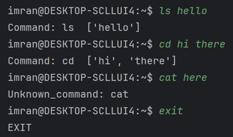
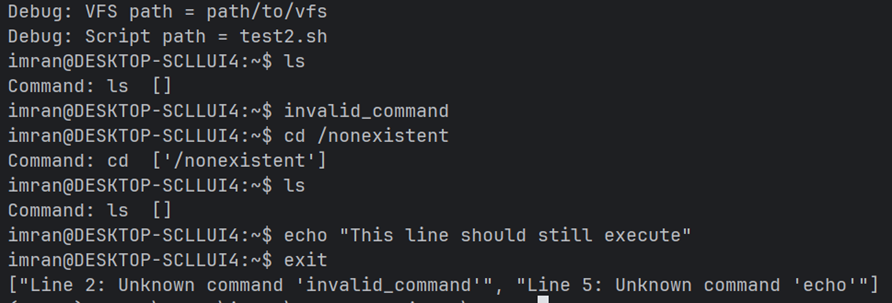
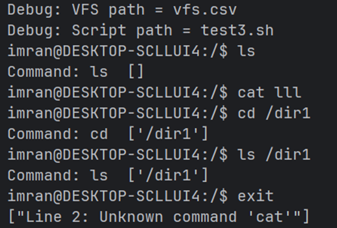
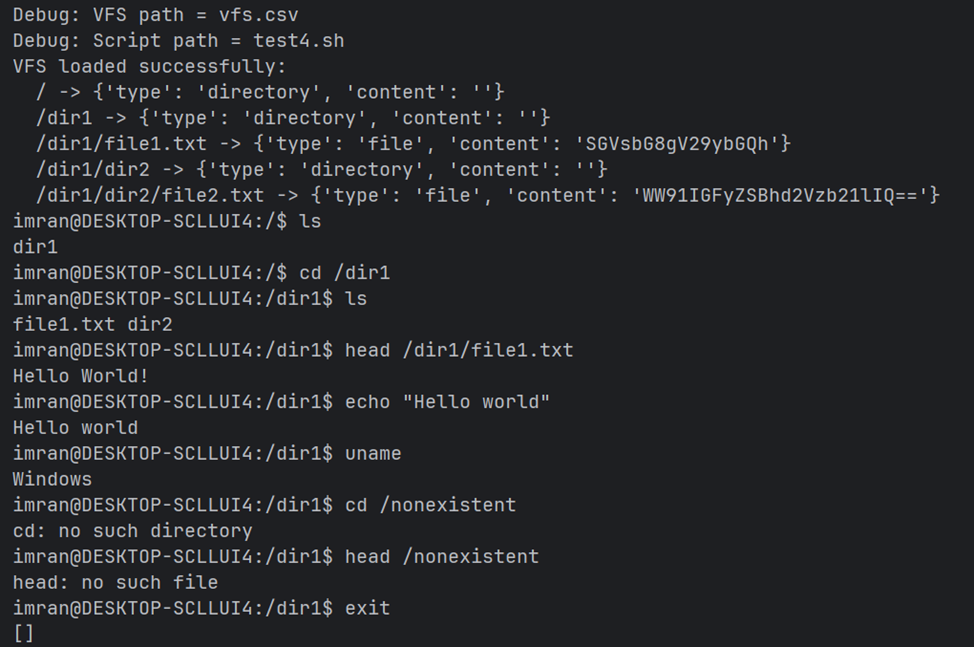

**4 вариант**

**Этап 1. REPL** 

Цель: создать минимальный прототип. Большинство функций в нем пока 
представляют собой заглушки, но диалог с пользователем уже поддерживается. 

**Этап 2. Конфигурация**

Цель: сделать эмулятор настраиваемым, то есть поддержать ввод параметров 
пользователя в приложение. Организовать для этого этапа отладочный вывод всех 
заданных параметров при запуске эмулятора.

**Этап 3. VFS**

Цель: подключить виртуальную файловую систему (VFS).

**Этап 4. Основные команды**

Цель: поддержать команды, имитирующие работу в UNIX-подобной 
командной строке.
